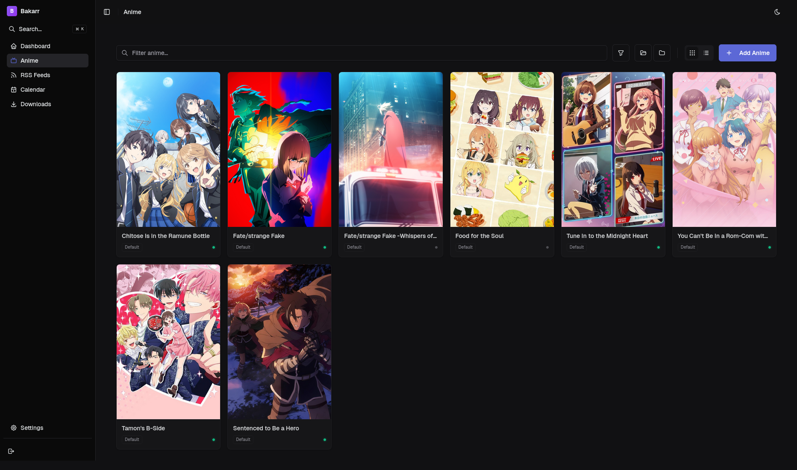

# Bakarr

A **Sonarr**-like anime download manager built specifically for anime, with intelligent torrent searching, quality management, and SeaDex integration for batch releases.



## Features

### Deployment
- **Single Binary**: The web UI is embedded in the executable, simplifying deployment.

### Core Functionality
- **Automated Anime Management**: Monitor anime series and automatically download new episodes
- **AniList Integration**: Search and track anime using the AniList API
- **Multi-Source**: Search torrents from Nyaa and SeaDex
- **Quality Profiles**: Manage download quality preferences with upgrade support
- **Episode Metadata**: Fetch episode titles and air dates from Jikan (MyAnimeList)
- **Smart Library Organization**: Automatically rename and organize files with episode titles

### Advanced Features
- **Batch Release Support**: Prioritize SeaDex batch releases for completed anime
- **RSS Feed Monitoring**: Track specific groups and resolutions
- **Manual Import**: Import existing anime files with intelligent matching
- **qBittorrent Integration**: Automatic torrent download management
- **Scheduler**: Background daemon with configurable check intervals
- **Quality Upgrades**: Automatically upgrade to better quality releases
- **Episode Tracking**: Track downloaded, missing, and wanted episodes

## Installation

### Prerequisites
- Rust 1.70+ (for building from source)
- Node.js 18+ or Bun (for building frontend)
- qBittorrent with Web UI enabled

### Building from Source

```bash
git clone https://github.com/yourusername/bakarr
cd bakarr

# Build the frontend first
cd bakarr-ui
npm install && npm run build
cd ..

# Build the backend (embeds the UI)
cargo build --release
```

The binary will be available at `./target/release/bakarr`

## Quick Start

1. **Initialize Configuration**
   ```bash
   bakarr --init
   ```

2. **Edit `config.toml`** with your settings:
   - qBittorrent connection details
   - Library paths
   - Quality profiles
   - Scheduler intervals

3. **Start the Daemon**
   ```bash
   bakarr daemon
   ```

4. **Access the Web UI**
   Open `http://localhost:6789` to manage your library.

## Configuration

The configuration file is located at `./config.toml`

### General Settings
```toml
[general]
database_path = "./bakarr.db"
log_level = "info"               # Options: error, warn, info, debug, trace
suppress_connection_errors = true # Silence noisy network/retry logs
images_path = "images"
```

### qBittorrent
```toml
[qbittorrent]
url = "http://localhost:8080"
username = "admin"
password = "adminadmin"
default_category = "bakarr"
```

### Library
```toml
[library]
library_path = "./library"
recycle_path = "./recycle"
recycle_cleanup_days = 7
naming_format = "{Series Title}/Season {Season}/{Series Title} - S{Season:02}E{Episode:02} - {Title}"
movie_naming_format = "{Series Title}/{Series Title}"
import_mode = "Copy"  # Options: Hardlink, Copy, Move
```

### Quality Profiles
```toml
[[profiles]]
name = "Default"
cutoff = "BluRay 1080p"
upgrade_allowed = true
seadex_preferred = true
allowed_qualities = [
    "BluRay 2160p",
    "WEB 2160p",
    "BluRay 1080p",
    "WEB 1080p",
    "BluRay 720p",
    "WEB 720p",
    "HDTV 1080p",
    "HDTV 720p"
]
```

### Scheduler
```toml
[scheduler]
enabled = true
check_interval_minutes = 15
max_concurrent_checks = 3
check_delay_seconds = 5
```

## Usage

The primary way to use Bakarr is through its Web UI.

### Web UI

Once the daemon is running, navigate to `http://localhost:6789` to:
- Monitor and add anime series
- View calendar and missing episodes
- Configure quality profiles
- Manage import and library settings
- View download history

### Command Line Interface (CLI)

Bakarr maintains a comprehensive CLI for scripting and headless management. To see the full list of available commands and options:

```bash
bakarr --help
```

## File Naming

Bakarr supports flexible file naming with the following variables:

- `{Series Title}` - The anime title
- `{Season}` - Season number
- `{Episode}` - Episode number
- `{Title}` - Episode title (fetched from Jikan/MAL)
- `{Quality}` - Quality from filename
- `{Group}` - Release group
- `{Year}` - Release year

Default format:
```
{Series Title}/Season {Season}/{Series Title} - S{Season:02}E{Episode:02} - {Title}
```

Example output:
```
BECK/Season 1/BECK - S01E01 - The View at Fourteen [WEB 1080p].mkv
```

## Quality System

### Quality Definitions
Bakarr recognizes the following quality tiers (highest to lowest):
1. BluRay 2160p (4K)
2. WEB 2160p
3. BluRay 1080p
4. WEB 1080p
5. BluRay 720p
6. WEB 720p
7. HDTV 1080p
8. HDTV 720p
9. HDTV 480p

### Quality Profiles
- Define allowed qualities for each anime
- Set cutoff quality (stop upgrading once reached)
- Enable/disable automatic upgrades
- Prefer SeaDex releases for best quality batches

## SeaDex Integration

Bakarr integrates with SeaDex to find the best quality batch releases for completed anime:

- Automatically detects when an anime is marked as "FINISHED"
- Searches SeaDex for optimal batch releases
- Prioritizes dual-audio and preferred release groups
- Caches results for 24 hours to respect API limits

## Database

Bakarr uses SQLite for data storage:
- Monitored anime and episodes
- Download history
- Episode metadata cache
- Quality profiles
- RSS feed configurations
- SeaDex cache

Database location: `./bakarr.db`

## Development

### Project Structure
```
bakarr/
├── src/
│   ├── clients/          # API clients (AniList, Nyaa, SeaDex, Jikan, etc.)
│   ├── db/              # Database operations
│   ├── library/         # File management and organization
│   ├── models/          # Data models
│   ├── parser/          # Filename parsing
│   ├── quality/         # Quality detection and profiles
│   ├── scheduler/       # Background task scheduling
│   ├── services/        # Business logic services
│   └── main.rs          # CLI and commands
├── migrations/          # Database migrations
└── config.toml         # Configuration file
```

### Building

```bash
# Debug build
cargo build

# Release build
cargo build --release

# Run tests
cargo test
```

## Roadmap

- [x] Web UI
- [x] Interactive profile creation/editing
- [x] Profile deletion with anime reassignment
- [ ] Notifications (Discord, Telegram, etc.)
- [ ] More indexers support
- [ ] Custom filter presets

## License

[MIT License](LICENSE)

## Credits

- Inspired by [Sonarr](https://sonarr.tv/)
- Uses [AniList](https://anilist.co/) for anime metadata
- Uses [Jikan](https://jikan.moe/) for episode metadata
- Uses [SeaDex](https://releases.moe/) for quality batch releases
- Uses [Nyaa](https://nyaa.si/) for torrent searches

## Contributing

Contributions are welcome! Please feel free to submit pull requests or open issues for bugs and feature requests.
